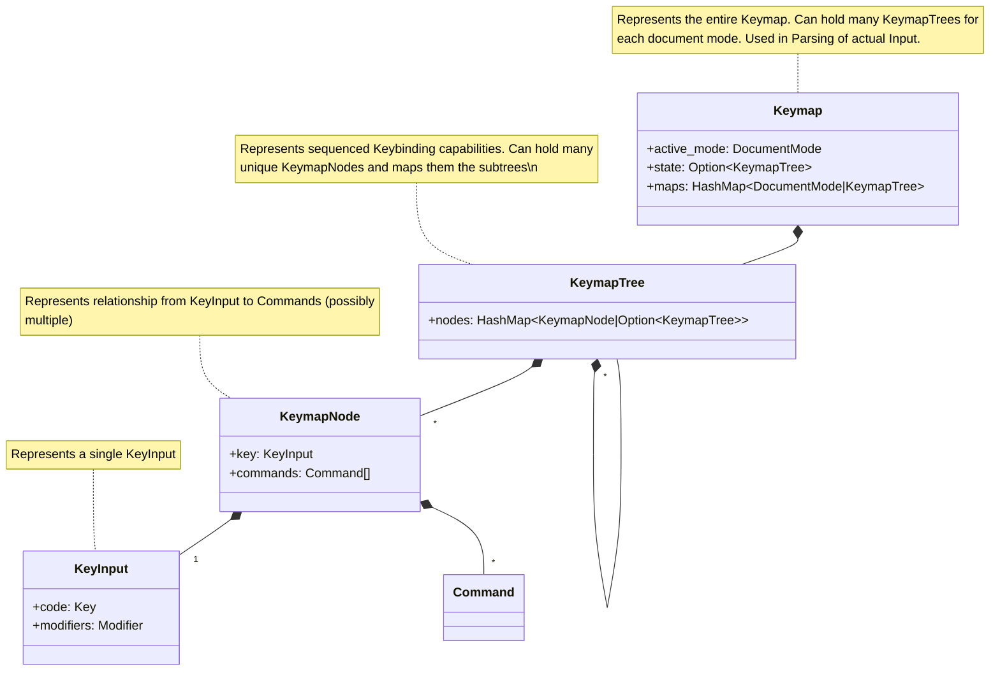
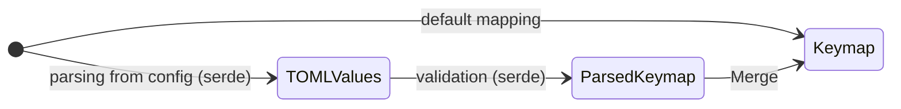
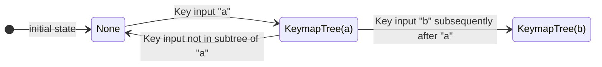

# Design DOC

`keymap` is responsible for mapping keys and sequences of keys to sequences of
commands. 

-- heavily "inspired" by helix

## Changes

- 09.05.2023: Created initial Draft

## Classes

The general idea is to structure the keymapping as a tree-like structure
where you will follow down the tree for sequences of key inputs.



## Behavior

**Construction of Keymap**

Implemented using serde. Config format in TOML.

```toml
[keys.normal]
"j" = "move_down" 
"CTRL-c" = "exit" # Note: Modifiers may be different in Code
```



**Parsing Key inputs**

State transitions based on the tree and current state. At each state, the
commands are executed. Will follow the longest match approach!



## Implementation Quirks

- Use `Arc`(from `arc_swap`) to allow for multiple references to the same KeymapTree
- Use `HashMap` for O(1) lookup of KeymapTree (and to avoid Tree Traversal
Implementation hehe)
- A subtree `None` denotes that it is the leaf
- Use `serde` for config deserialization
- Add Whitecard Character matching to allow for "any" key input

